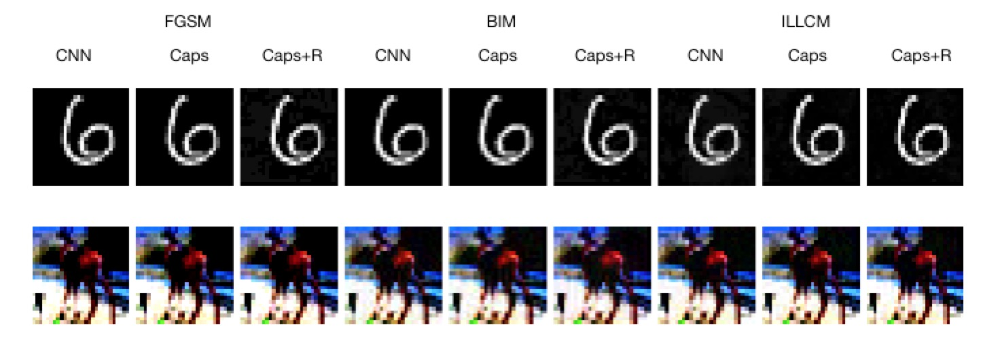

# Adversarial Attacks on Capsule Neural Networks
Code for thesis (first part): [Adversarial Attacks on Capsule Neural Networks](https://github.com/XxuChen/Adversarial-Attack-on-CapsNets)
## Prerequisite
- Python3
- Tensorflow
- NumPy
- GPU
- sklearn

## Generated Adversarial Examples with Different Models and Datasets


## Download and Prepare Datasets
```
chmod +x ./download_data.sh && python prepre_dataset.py
```

## Sample Commands
Here are some sample commands to run training, test, or generating adversarial attacks. More commands can be referred in folder `scripts`.

### Train
```
source ~/tfp363/bin/activate

REPO_DIR=/home/xuc/Adversarial-Attack-on-CapsNets
SUMMARY_DIR=/home/xuc/scratch/xuc/summary/

MODEL=caps
DATASET=cifar10

python $REPO_DIR/experiment.py --data_dir=$REPO_DIR/data/$MODEL/$DATASET --dataset=$DATASET --summary_dir=$SUMMARY_DIR --model=$MODEL --hparams_override=remake=false
```

### Test
```
source ~/tfp363/bin/activate

REPO_DIR=/home/xuc/Adversarial-Attack-on-CapsNets
SUMMARY_DIR=/home/xuc/scratch/xuc/summary/

MODEL=caps
DATASET=cifar10

TEST_FILE=test.npz

python $REPO_DIR/experiment.py --mode=test --summary_dir=$SUMMARY_DIR/$MODEL/$DATASET/Default --load_test_path=$REPO_DIR/data/$MODEL/$DATASET/$TEST_FILE
```

### Generate Adversarial Examples
```
source ~/tfp363/bin/activate

REPO_DIR=/home/xuc/Adversarial-Attack-on-CapsNets
SUMMARY_DIR=/home/xuc/scratch/xuc/summary/

MODEL=caps
DATASET=cifar10

ADVERSARIAL_METHOD=BIM 
EPSILON=1
ITERATION_N=2

python $REPO_DIR/experiment.py --mode=gen_adv --data_dir=$REPO_DIR/data/$MODEL/$DATASET --dataset=$DATASET --adversarial_method=$ADVERSARIAL_METHOD --epsilon=$EPSILON --iteration_n=$ITERATION_N --summary_dir=$SUMMARY_DIR/$MODEL/$DATASET/Default/
```